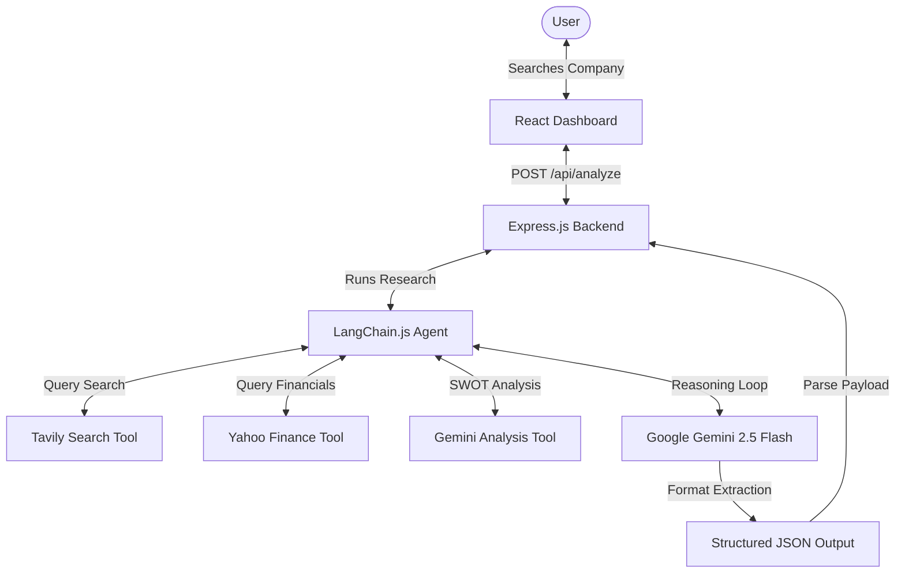

# ValuationAI: AI Investment Research Agent

An AI-powered Investment Research Agent that performs automated equity analysis on publicly traded companies. Users submit a company name, and the agent uses a **LangChain** agent architecture equipped with web search (**Tavily**) and financial summaries (**Yahoo Finance**) to research the company. It evaluates the business under multiple dimensions, reaches an investment recommendation (`INVEST` or `PASS`), and generates a dashboard of stats, metrics, pros/cons, and recent news.

---

## Architecture Flow

The system operates as a multi-tier agentic pipeline:



1. **User Request**: User inputs a company name (e.g., "Apple" or "Nvidia") in the React interface.
2. **Backend Express Entry**: The request hits `/api/analyze` which invokes the LangChain Agent.
3. **LangChain Agent Research**:
   - **Yahoo Finance Tool**: Resolves the company name to a stock ticker symbol (e.g., "AAPL") and pulls key metrics (market cap, revenue, profit, PE ratios, debt ratios).
   - **Company Search (Tavily)**: Executes web searches to retrieve recent press, competitive changes, and regulatory news.
   - **Gemini Sub-Analysis Tool**: Triggers focused Gemini sub-chains to analyze specific aspects (Business Model, Risks, Innovation, SWOT signals).
4. **Structured Formatting**: The agent outputs a synthesized text report. This text, combined with the raw financial metrics, is processed by a Gemini Structured Output chain using a strict **Zod Schema** to yield a perfect JSON response.
5. **Dashboard Rendering**: The React frontend parses the structured JSON response and displays the visual card panels with smooth transitions and theme styling.

---

## Tech Stack

### Frontend
- **Framework**: React.js (Vite template)
- **Styling**: Tailwind CSS (custom glassmorphic theme, light/dark mode support)
- **Icons**: Lucide React
- **API Client**: Axios

### Backend
- **Server**: Node.js & Express.js
- **Orchestration**: LangChain.js
- **Model**: Google Gemini API (`gemini-2.5-flash`)
- **Data Integrations**: 
  - Yahoo Finance API (`yahoo-finance2` package)
  - Tavily Search API

---

## Folder Structure

```
investment-agent/
├── client/                 # Frontend React + Vite
│   ├── public/
│   ├── src/
│   │   ├── components/     # Reusable UI Cards
│   │   │   ├── CompanyOverviewCard.jsx
│   │   │   ├── FinancialMetrics.jsx
│   │   │   ├── Footer.jsx
│   │   │   ├── LoadingSpinner.jsx
│   │   │   ├── Navbar.jsx
│   │   │   ├── NewsSection.jsx
│   │   │   ├── ProsCons.jsx
│   │   │   ├── RecommendationCard.jsx
│   │   │   └── SearchBar.jsx
│   │   ├── App.jsx         # App State & Main Layout
│   │   ├── index.css       # Tailwind & custom styles
│   │   └── main.jsx
│   ├── index.html
│   ├── package.json
│   ├── postcss.config.js
│   ├── tailwind.config.js
│   └── vite.config.js
├── server/                 # Backend Node + Express
│   ├── config/
│   │   └── env.js          # Config and validation
│   ├── controllers/
│   │   └── analyzeController.js
│   ├── routes/
│   │   └── analyzeRoute.js
│   ├── services/
│   │   └── yahooFinanceService.js
│   ├── langchain/
│   │   ├── agent.js        # LangChain agent loop
│   │   └── tools.js        # Tavily, Yahoo, & Gemini Tools
│   ├── middleware/
│   │   └── errorHandler.js # Global error handler
│   ├── index.js            # Express Entry
│   ├── package.json
│   ├── .env
│   └── .env.example
└── README.md
```

---

## Environment Variables

Create a `.env` file in the `server/` directory. Use the template in `server/.env.example`:

```env
PORT=5000
GEMINI_API_KEY=your_gemini_api_key_here
TAVILY_API_KEY=your_tavily_api_key_here
NODE_ENV=development
```

- **`GEMINI_API_KEY`**: Obtain from the [Google AI Studio Console](https://aistudio.google.com/).
- **`TAVILY_API_KEY`**: Obtain from the [Tavily Search Dashboard](https://tavily.com/).

---

## Running Locally

### Step 1: Clone and Install Dependencies

```bash
# Install Server Dependencies
cd server
npm install

# Install Client Dependencies
cd ../client
npm install
```

### Step 2: Configure Keys
Copy the `.env.example` in `server/` to `.env` and fill in your actual Gemini and Tavily API keys.

```bash
cp server/.env.example server/.env
```

### Step 3: Run the Servers

Open two terminal instances:

**Terminal 1 (Backend)**:
```bash
cd server
npm run dev
# Server will run on http://localhost:5000
```

**Terminal 2 (Frontend)**:
```bash
cd client
npm run dev
# Client will run on http://localhost:3000 (proxied to server)
```

Open `http://localhost:3000` in your web browser.

---

## API Documentation

### POST `/api/analyze`
Submits a company name to undergo automated research and evaluation.

#### Request Body
```json
{
  "company": "Apple"
}
```

#### Response Body (Strict JSON)
```json
{
  "company": "Apple Inc.",
  "industry": "Consumer Electronics",
  "summary": "Apple Inc. designs, manufactures, and markets smartphones, personal computers, tablets, wearables, and accessories worldwide. Its key business model focuses on ecosystem lock-in and high-margin services.",
  "marketCap": "$3.42 Trillion",
  "revenue": "$385.6 Billion",
  "profit": "$97.0 Billion",
  "peRatio": "31.4",
  "financialHealth": 9,
  "growth": 7,
  "risk": 4,
  "innovation": 8,
  "pros": [
    "High operating margins and customer loyalty index.",
    "Services division (iCloud, Apple Pay) is experiencing double-digit compounding growth.",
    "Robust balance sheet with significant free cash flow yield."
  ],
  "cons": [
    "Hardware upgrade cycles for smartphones are extending globally.",
    "Increasing regulatory pushback and antitrust lawsuits on App Store fees in EU and US."
  ],
  "news": [
    {
      "title": "Apple Intelligence features roll out, driving upgrade expectations",
      "url": "https://finance.yahoo.com/news/apple-intelligence...",
      "summary": "Apple is slowly rolling out AI features to current device lines, which analysts hope will initiate a new smartphone hardware cycle."
    }
  ],
  "recommendation": "INVEST",
  "confidence": 88,
  "reason": "Apple's financial health remains outstanding with strong cash flows, while its services segment expands its competitive moat. Despite slowing hardware cycles and regulatory friction, the company's innovation in consumer-grade AI features supports a long-term INVEST rating."
}
```

---

## Deployment

### Frontend (Vercel)
Vite builds static files which deploy natively to Vercel.
1. Install Vercel CLI or link your repository to Vercel.
2. In the Vercel project dashboard, set the root directory to `client`.
3. Set the build command to `npm run build` and output directory to `dist`.
4. Configure a rewrites file (`vercel.json` at client root) to route `/api/*` requests to your backend server:
   ```json
   {
     "rewrites": [
       { "source": "/api/(.*)", "destination": "https://your-backend-server.onrender.com/api/$1" }
     ]
   }
   ```

### Backend (Render)
Render hosts Node/Express applications.
1. Create a new "Web Service" in Render.
2. Connect your Git repository.
3. Set root directory to `server`.
4. Set build command to `npm install`.
5. Set start command to `npm start`.
6. Add your environment variables in the Render Dashboard (`GEMINI_API_KEY`, `TAVILY_API_KEY`, `PORT`, `NODE_ENV`).

---

## Trade-offs & Decisions

1. **Two-Stage Analysis Architecture**: 
   Rather than forcing the LangChain agent to output JSON directly during its tool-use loop (which can cause tool-selection crashes or parser loops when model tokens are consumed), we separated **reasoning** and **formatting**. The agent first synthesizes research into raw text, and a secondary Gemini model call structured with Zod maps this synthesis into the target JSON structure. This results in 100% JSON schema compliance with zero agent crashes.
2. **Custom REST Wrapper for Tavily**:
   Instead of pulling in large community packages (like `@langchain/community`) which frequently introduce version mismatch dependencies in Node, we built a thin, robust REST utility tool using standard HTTP fetch requests. This ensures stability, easy debugging, and fewer external node modules.
3. **Implicit Ticker Mapping**:
   The Yahoo Finance API uses ticker symbols (like `AAPL`) whereas users enter company names (like "Apple"). We implemented an auto-resolving ticker mechanism in `yahooFinanceService.js` that searches for the company, filters by quotes of type `EQUITY` on primary exchanges, and falls back to standard quotes, ensuring search terms resolve to tickers with high accuracy.

---

## Future Improvements

- **Database Cache**: Store analysis records (e.g., in MongoDB/PostgreSQL) with a 24-hour expiration window. This reduces costs and stops duplicate Tavily and Gemini requests for identical searches.
- **Stock Historical Charts**: Integrate `chart.js` or `recharts` in React and fetch historical charts from Yahoo Finance to plot prices over a 1-year window.
- **Comparing Stocks**: Add a comparison drawer in the dashboard where two companies can be searched and side-by-side scoring cards are compared directly.
